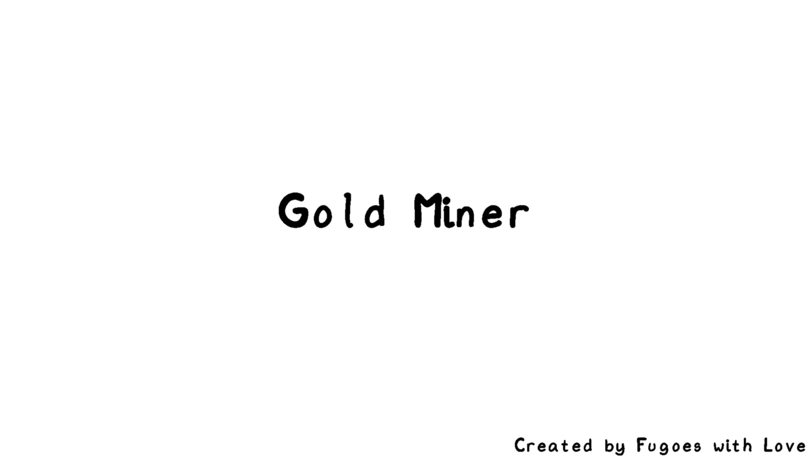
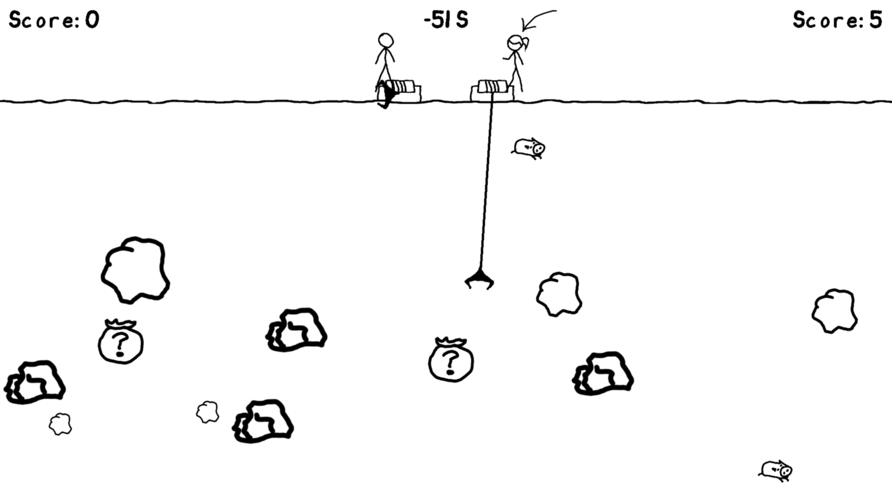

# Gold Miner

## Introduction

This project is a two players online gold miner game written in Java. I wrote it to hand it in as homework...

## How to play

```
# Player Zero
java -jar GoldMiner.jar <Port Number> <FPS>
# Player One
java -jar GoldMiner.jar <IP Address> <Port Number> <FPS>
```
For example, if you want to play it from localhost:
```
# Player Zero
java -jar GoldMiner.jar 9999 60
# Player One
java -jar GoldMiner.jar 127.0.0.1 9999 60
```
Press `DOWN` key to move, press `SPACE` key to pause or resume the game.

## License

* The code of `Gold Miner` is licensed under the [WTFPL](http://www.wtfpl.net/).
* The font is from [xkcd-font](https://github.com/ipython/xkcd-font), which is licensed under [Creative Commons Attribution-NonCommercial 3.0 License](https://github.com/ipython/xkcd-font/blob/master/LICENSE).
* The background music is from [here](https://www.youtube.com/watch?v=flSdI_AwrU4). The music played when `DOWN` key pressed is from [here](https://freesound.org/people/juancamiloorjuela/sounds/204647/). Both are licensed under [Creative Commons](https://creativecommons.org/) license.
* Other resources are created using [Krita](https://krita.org/) by myself, they are licensed under [Creative Commons Attribution-NonCommercial 4.0 International License](https://creativecommons.org/licenses/by-nc/4.0/).

Note that you shall NOT hand it in as your homework.

## Screenshots



